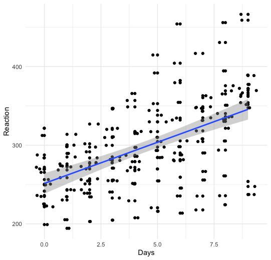

# Sleep and reaction time analyses

<figure>
  
  <figcaption>Move on when green</figcaption>
</figure>

<figure>
  
  <figcaption>Effect of days with sleeping problems on reaction time.</figcaption>
</figure>
